# LMS Assignment

### Features Implemented

- Biometric Auth With Session Management (120 Seconds of Inactivity Logs Out From Them App)
- Implemented Summary Tabs Along With Network Calls & UI
- Implemented Batting & Bowling Tabs With Network Calls & UI
- Preserved States Throught Navigation
- Handled UI States Like Loading, Loaded & Error While Making Network Calls

### Stack & Libs
- Kotlin
- MVVM
- Coroutines
- ViewModel, LiveData
- Retrofit, Coil, GSon
- XML & Material Design

## Screenshots & GIF

<table style="width:100%">
  <tr>
    <th>Summary GIF</th>
    <th>Batting GIF</th> 
    <th>Bowling GIF</th>
  </tr>
  <tr>
    <td>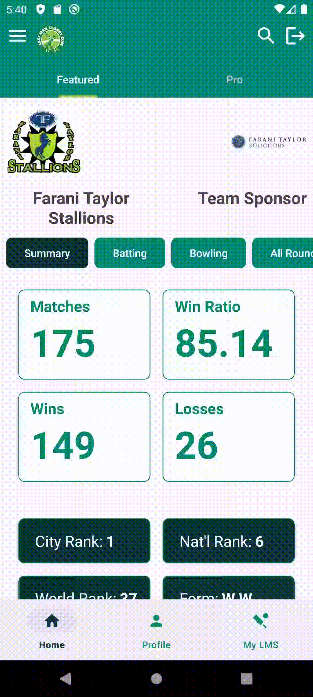</td> 
    <td>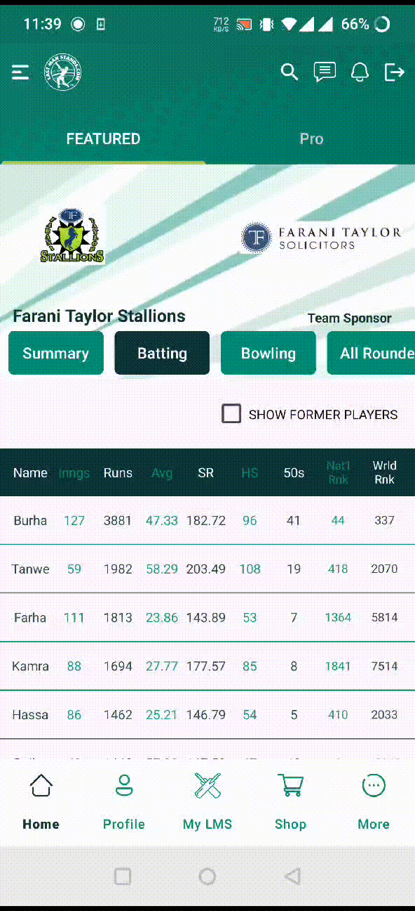</td> 
    <td>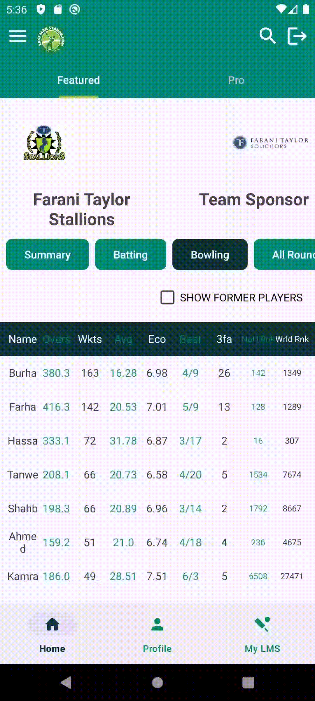</td>
  </tr>
</table>

<table style="width:100%">
  <tr>
    <th>Login Screen</th>
    <th>Auth Prompt</th> 
    <th>Batting Tab</th>
    <th>Bowling Tab</th>
  </tr>
  <tr>
    <td>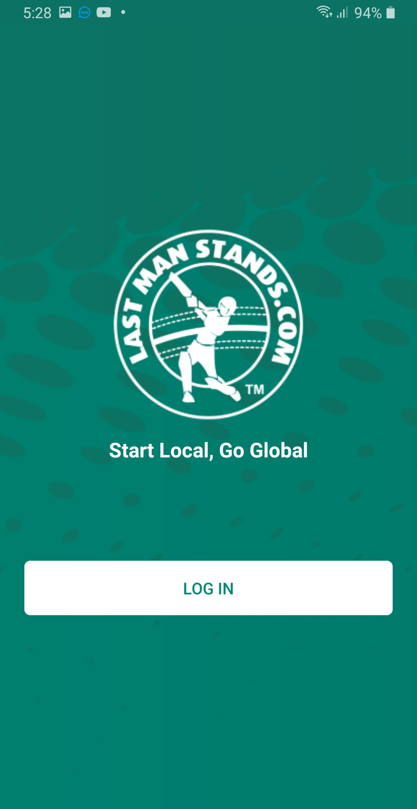</td> 
    <td>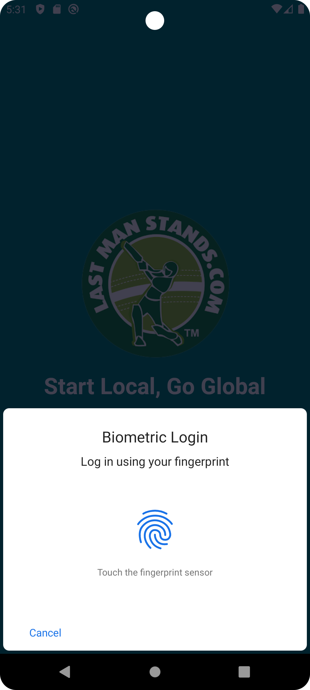</td>
    <td>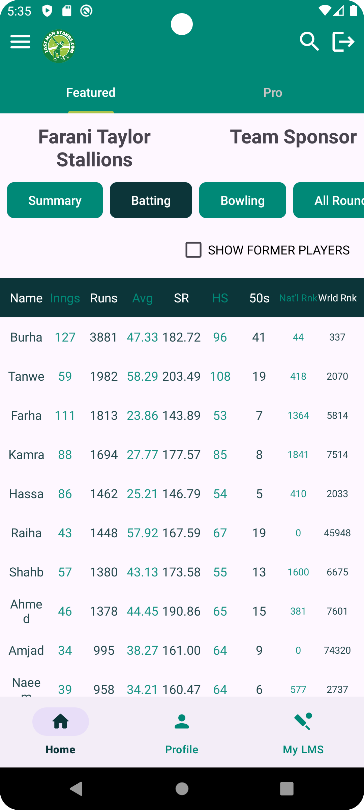</td> 
    <td>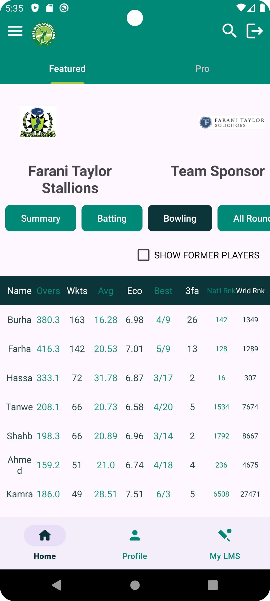</td>
  </tr>
</table>

<table style="width:100%">
    <tr>
    <th>Summary Tab</th>
    <th>Squad List</th> 
    <th>Recent Videos</th>
    <th>Top Players</th>
    </tr>
    <tr>
    <td>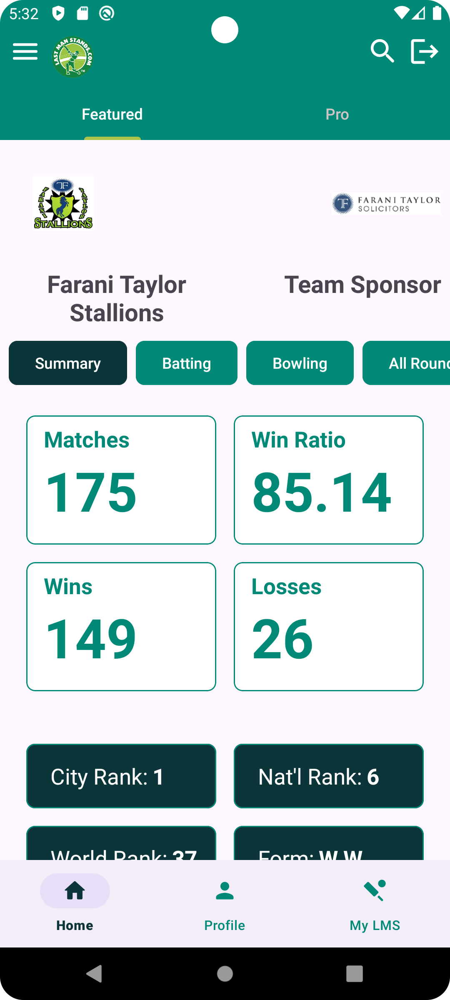</td> 
    <td>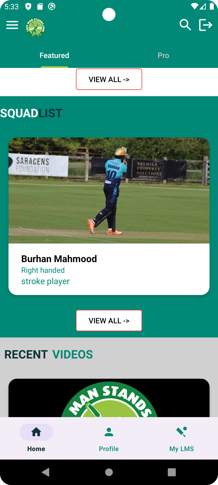</td> 
    <td>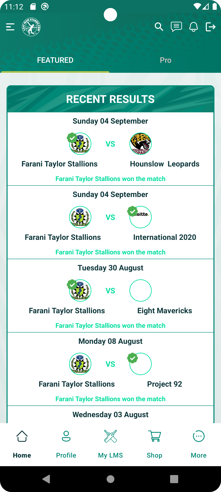</td>
    <td>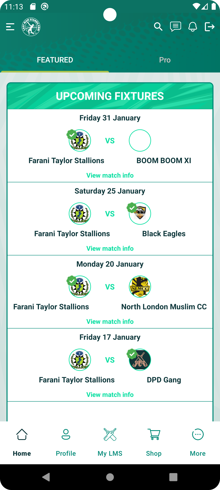</td>
  </tr>
</table>

## 📂 MVVV - Project Structure

Here’s an overview of the project structure:
```plaintext
.
└── lmsassignment
├── data
│   ├── model
│   │   ├── BattingResponse.kt
│   │   ├── BowlingResponse.kt
│   │   ├── JsonParsing.kt
│   │   ├── SquadResponse.kt
│   │   └── SummaryResponse.kt
│   └── remote
│       └── api
│           └── ApiService.kt
├── MyApp.kt
├── utils
│   ├── AppUiState.kt
│   ├── Const.kt
│   ├── SharedPrefManager.kt
│   └── Views.kt
├── view
│   ├── AuthActivity.kt
│   ├── bottom_nav
│   │   ├── HomeFragment.kt
│   │   ├── MyLMSFragment.kt
│   │   └── ProfileFragment.kt
│   ├── child_tabs
│   │   ├── adapter
│   │   │   ├── BatingAdapter.kt
│   │   │   ├── BowlingAdapter.kt
│   │   │   ├── ChildTabAdapter.kt
│   │   │   ├── SquadAdapter.kt
│   │   │   ├── TopPlayersAdapter.kt
│   │   │   └── VideoAdapter.kt
│   │   ├── AFragment.kt
│   │   ├── BFragment.kt
│   │   └── CFragment.kt
│   ├── HomeActivity.kt
│   └── parent_tabs
│       ├── adapter
│       │   └── ParentTabAdapter.kt
│       ├── FeaturedFragment.kt
│       └── ProFragment.kt
└── view_model
└── LMSViewModel.kt
